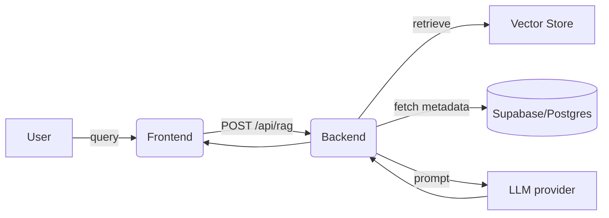

# Version 2 uploaded succesfully 
https://minirag-2.vercel.app/
<div align="center">
   
# 🚀 EDURAG — Enterprise Knowledge Intelligence Platform

<p align="center">
   <strong>Semantic Search & Retrieval-Augmented Generation (RAG) for teams, educators, and students — powered by Gemini AI & Supabase</strong>
</p>

<p align="center">
   
   
   
   
   
</p>

</div>

---

## 🌟 About the Project

MINIRAG2 is an enterprise platform combining semantic search and Retrieval-Augmented Generation (RAG) to deliver accurate, source-backed answers from documents and knowledge bases. Designed for internal teams, educators, and students.

**Key Goals:**
- Reliable, explainable answers with source citations
- Accessible search & Q&A for non-technical users
- Feedback, analytics, and continuous improvement

**Live Deployment:** Frontend on Vercel, backend APIs under `/api`.

---

## ❓ Problem Statement

Organizations have growing volumes of documents. Simple keyword search is not enough. MINIRAG2 solves:
- Fast, accurate answers with source citations
- Knowledge spread across formats and locations
- Feedback loop for continuous improvement

---

## 🏗️ System Architecture

**Components:**
- Frontend (React): UI, query input, result rendering, feedback
- Backend (FastAPI/Python): API endpoints, RAG orchestration, auth, feedback
- Vector store: document vectors for similarity search
- LLM provider: generates answers from context
- Database (Supabase/Postgres): users, docs, feedback, analytics

**High-level Data Flow:**



---

## 🛠️ Technology Stack

- **Frontend:** React, CSS Modules, Axios
- **Backend:** Python 3.8+, FastAPI, Uvicorn
- **Database:** Supabase/Postgres
- **Vector Store:** Supabase vector extension or external
- **AI/ML:** Gemini AI, OpenAI (optional)
- **Deployment:** Vercel, GitHub Actions (optional)

---

## 🔄 Implementation Flow

1. **Document Ingestion:** Extract text, normalize, split into passages
2. **Embedding Generation:** Convert passages to vector embeddings
3. **Vector Store:** Store embeddings with metadata
4. **Query Handling:** User query → embedding → top-K similar passages
5. **LLM Synthesis:** Compose prompt, generate answer with citations
6. **Feedback & Iteration:** Users rate answers, feedback improves ranking

---

## 🗄️ Database Design

**Main Tables:**
- `users`: id, email, hashed_password, role, created_at
- `documents`: id, title, source_url, uploaded_by, created_at
- `passages`: id, document_id, text, chunk_index, metadata
- `embeddings`: id, passage_id, vector, created_at
- `feedback`: id, user_id, query, response, rating, comment

---

## 📡 API Reference

**Auth:**
- `POST /api/auth/login` — login
- `POST /api/auth/register` — register
- `GET /api/auth/me` — profile

**RAG/Search:**
- `POST /api/rag` — semantic search
- `POST /api/rag/upload-pdf` — upload PDF
- `POST /api/rag/index-pdf/{id}` — index PDF
- `GET /api/rag/pdfs` — list PDFs
- `DELETE /api/rag/pdfs/{id}` — delete PDF

**Feedback:**
- `POST /api/feedback` — submit feedback

**Analytics:**
- `GET /api/analytics/usage` — usage metrics

---

## ✨ Features

### 🎓 For Students
- RAG Search — ask questions, get AI answers with citations
- PDF Upload — organize study materials
- Peer Discovery — connect with classmates
- Anonymous Feedback — share thoughts with teachers
- Profile Management — customize name/avatar
- **Unique Chatroom** — real-time, secure, interactive discussions

### 👨‍🏫 For Teachers
- Content Upload & Indexing
- Student Analysis — trending topics
- Feedback Dashboard
- Analytics Overview
- RAG Search

### 🔧 For Admins
- User Management
- System Analytics
- PDF Management
- RAG Search
- Feedback Review

---

## ✅ Completed Features

- React SPA with role-based dashboards
- Custom JWT authentication
- 100% Supabase migration
- PDF upload & indexing
- RAG semantic search
- AI-generated answers with citations
- Keyword fallback search
- Search history tracking
- Trending topics analytics
- Feedback systems
- User management
- System analytics dashboard
- Animated UI
- Vercel serverless deployment
- CORS for Vercel, Codespaces, localhost

---

## 🗺️ Future Roadmap

- Forgot Password (OTP reset)
- Google OAuth integration
- Mobile optimization
- Real-time collaboration
- Advanced analytics
- Video content support
- Batch document processing
- Improved Hindi/Hinglish support

---

## 🚀 Deployment & Local Development

**Frontend:** Vercel project from GitHub repo
**Backend:** Vercel Serverless Functions or separate deployment (Railway, Fly, Heroku)

**Environment Variables:**
See `backend/.env.example` for required keys. Never commit `.env` files.

---

## 👥 Project Team

**Team Leader:** Khushi Sara ([GitHub](https://github.com/khushisara1))
**Contributors:** Kavya Rajput ([GitHub](https://github.com/KAVYA-29-ai)), Harshita Shakya ([GitHub](https://github.com/HarshitaShakya))

**Repository:** [MINIRAG2](https://github.com/KAVYA-29-ai/MINI-RAG)

---

## 📚 More Information

For detailed guides, features, and architecture, see the [documentation](documentation/01_about_project.md) folder.

<div align="center">

### ⭐ Star this repository if you find it useful!

**Made with ❤️ for education**

[Report Bug](https://github.com/KAVYA-29-ai/MINI-RAG/issues) · [Request Feature](https://github.com/KAVYA-29-ai/MINI-RAG/issues)

</div>

---

## 🌟 Overview

**EduRag** is an intelligent educational platform that uses **Retrieval Augmented Generation (RAG)** powered by **Google Gemini AI** to let students and teachers search, query, and get AI-generated answers from uploaded PDFs.

- **100% Supabase** — all data (users, PDFs, embeddings, analytics) stored in Supabase PostgreSQL + Storage. Zero local storage.
- **Fully Serverless** — deployed on Vercel (React static + FastAPI serverless function). No separate backend server needed.
- **Gemini Multimodal RAG** — semantic search with vector embeddings, AI-generated answers with source citations.

---

## ✨ Features

### 🎓 For Students
- **RAG Search** — ask questions in natural language, get AI-generated answers with source citations
- **PDF Upload** — upload and organize study materials
- **Peer Discovery** — view and connect with classmates (Buddies)
- **Anonymous Feedback** — share thoughts with teachers anonymously
- **Profile Management** — customize name and avatar

### 👨‍🏫 For Teachers
- **Content Upload & Indexing** — upload PDFs and index them for RAG search
- **Student Analysis** — monitor trending topics students are searching for
- **Feedback Dashboard** — receive and respond to student feedback
- **Analytics Overview** — class engagement and performance metrics
- **RAG Search** — search across all uploaded materials

### 🔧 For Admins
- **User Management** — manage all users, change roles (student/teacher/admin)
- **System Analytics** — platform-wide usage statistics
- **PDF Management** — upload, index, and manage all PDFs
- **RAG Search** — system-wide search across all content
- **Feedback Review** — review all teacher feedback

---

## 🛠️ Tech Stack

| Layer | Technology |
|-------|-----------|
| **Frontend** | React 18, React Router v6, Axios, CSS3 |
| **Backend** | FastAPI (Python), Pydantic, Python-JOSE (JWT), Passlib (bcrypt) |
| **Database** | Supabase PostgreSQL (8 tables + RLS policies) |
| **Storage** | Supabase Storage (private `pdfs` bucket) |
| **AI/ML** | Google Gemini AI — `gemini-embedding-001` (embeddings), `gemini-3-flash-preview` (generation) |
| **Deployment** | Vercel (React static + Python serverless function) |

---

## 🏗️ Architecture

```
┌──────────────────┐        ┌───────────────────┐        ┌──────────────────┐
│  React SPA       │        │  FastAPI           │        │  Supabase        │
│  (Vercel CDN)    │◄──────►│  (Vercel Serverless│◄──────►│  PostgreSQL +    │
│                  │  HTTPS │   Python Function) │  SQL   │  Storage         │
└──────────────────┘        └───────────────────┘        └──────────────────┘
                                     │
                                     ▼
                            ┌───────────────────┐
                            │  Google Gemini AI  │
                            │  Embeddings +      │
                            │  Generation        │
                            └───────────────────┘
```

### Data Flow
1. **Authentication** → Custom JWT (bcrypt + python-jose) → Role-based access (student/teacher/admin)
2. **PDF Upload** → Supabase Storage → Extract text (PyPDF) → Chunk → Embed with Gemini → Store vectors in Supabase
3. **RAG Search** → Query embedding → Cosine similarity (threshold ≥ 0.65) → Top results → Gemini generates answer with source citations
4. **Analytics** → Event tracking → Supabase aggregation → Dashboard visualization

---

## 🚀 Deployment (Vercel)

The entire app deploys as **one Vercel project** — React frontend as static files, FastAPI backend as a Python serverless function.

### Steps

1. **Push to GitHub**
   ```bash
   git add -A && git commit -m "deploy" && git push origin main
   ```

2. **Import in Vercel**
   - Go to [vercel.com/new](https://vercel.com/new)
   - Import `KAVYA-29-ai/MINIRAG2`

3. **Add Environment Variables** in Vercel dashboard:
   | Variable | Description |
   |----------|-------------|
   | `SUPABASE_URL` | Supabase project URL |
   | `SUPABASE_KEY` | Supabase anon/public key |
   | `SUPABASE_SERVICE_ROLE_KEY` | Supabase service role key |
   | `GEMINI_API_KEY` | Google Gemini API key |
   | `JWT_SECRET` | Secret key for JWT tokens |
   | `JWT_ALGORITHM` | `HS256` |
   | `ACCESS_TOKEN_EXPIRE_MINUTES` | `60` |

4. **Deploy** — click Deploy and you're live!

---

## 💻 Local Development

### Prerequisites
- Node.js 16+ & npm
- Python 3.11+
- Supabase account (create tables using `backend/supabase_schema.sql`)
- Google Gemini API key

### Setup

```bash
# Clone
git clone https://github.com/KAVYA-29-ai/MINIRAG2.git
cd MINIRAG2

# Frontend
npm install

# Backend
cd backend
pip install -r requirements.txt
cp .env.example .env   # Fill in your keys
cd ..

# Run both
npm start                                            # React on :3000
cd backend && uvicorn main:app --reload --port 8000  # API on :8000
```

---

## 📁 Project Structure

```
MINIRAG2/
├── api/
│   └── index.py                # Vercel serverless entry point
├── backend/
│   ├── main.py                 # FastAPI app + CORS + SPA serving
│   ├── database.py             # Supabase client initialization
│   ├── models.py               # Pydantic request/response models
│   ├── supabase_schema.sql     # All 8 tables + RLS + storage bucket
│   ├── requirements.txt        # Python dependencies
│   ├── .env.example            # Environment variable template
│   └── routers/
│       ├── auth.py             # Register, Login, JWT, /me
│       ├── users.py            # User CRUD, role management
│       ├── rag.py              # RAG search, PDF upload/index/delete
│       ├── feedback.py         # Teacher ↔ Admin feedback
│       └── analytics.py        # Usage stats & student insights
├── src/
│   ├── pages/
│   │   ├── HomePage.js         # Landing page
│   │   ├── LoginRegister.js    # Auth page (register/login)
│   │   ├── StudentDashboard.js # Student: RAG search, buddies, feedback
│   │   ├── TeacherDashboard.js # Teacher: search, PDF manage, analytics
│   │   └── AdminDashboard.js   # Admin: users, feedback, search, PDFs
│   ├── components/
│   │   └── AnimatedBackground.js
│   ├── services/
│   │   └── api.js              # Axios API service layer
│   ├── App.js                  # React Router setup
│   └── index.js                # React entry
├── build/                      # Production React build
├── public/                     # Static assets
├── vercel.json                 # Vercel deployment config
├── package.json                # Node dependencies
└── requirements.txt            # Root requirements (for Vercel)
```

---

## 🗄️ Database Schema (Supabase)

| Table | Purpose |
|-------|---------|
| `users` | User accounts (institute_id, name, password_hash, role, avatar) |
| `search_history` | RAG search logs per user |
| `feedback` | Teacher → Admin feedback with responses |
| `student_feedback` | Student → Teacher anonymous feedback |
| `analytics_events` | Usage tracking events |
| `pdfs` | Uploaded PDF metadata |
| `pdf_chunks` | Extracted text chunks from PDFs |
| `rag_embeddings` | Gemini vector embeddings for each chunk |

Storage: Private `pdfs` bucket in Supabase Storage.

---

## 📡 API Endpoints

### Auth
| Method | Endpoint | Description |
|--------|----------|-------------|
| POST | `/api/auth/register` | Register new user |
| POST | `/api/auth/login` | Login, get JWT token |
| GET | `/api/auth/me` | Get current user profile |
| POST | `/api/auth/logout` | Logout |

### RAG Search
| Method | Endpoint | Description |
|--------|----------|-------------|
| POST | `/api/rag/search` | Semantic RAG search with AI answer |
| POST | `/api/rag/upload-pdf` | Upload PDF (teacher/admin) |
| POST | `/api/rag/index-pdf/{id}` | Index PDF for search (teacher/admin) |
| GET | `/api/rag/pdfs` | List all PDFs |
| DELETE | `/api/rag/pdfs/{id}` | Delete PDF (teacher/admin) |
| GET | `/api/rag/search-history` | User's search history |
| GET | `/api/rag/trending` | Trending search topics |

### Users
| Method | Endpoint | Description |
|--------|----------|-------------|
| GET | `/api/users/` | List all users (admin) |
| GET | `/api/users/students` | List students |
| GET | `/api/users/teachers` | List teachers |
| PUT | `/api/users/{id}/role` | Change user role (admin) |
| DELETE | `/api/users/{id}` | Delete user (admin) |

### Feedback & Analytics
| Method | Endpoint | Description |
|--------|----------|-------------|
| POST | `/api/feedback/` | Submit feedback |
| GET | `/api/feedback/` | Get all feedback (admin) |
| GET | `/api/analytics/summary` | System analytics (admin) |
| GET | `/api/analytics/student-insights` | Student trends (teacher) |

---

## ✅ Completed Features

- [x] React SPA with role-based dashboards (Student, Teacher, Admin)
- [x] Custom JWT authentication (register, login, role management)
- [x] 100% Supabase migration (8 tables + storage bucket, zero local DB)
- [x] PDF upload to Supabase Storage
- [x] PDF indexing — text extraction → chunking → Gemini embedding → store vectors
- [x] RAG semantic search with cosine similarity (threshold ≥ 0.65)
- [x] AI-generated answers using Gemini with source citations
- [x] Keyword fallback search when semantic search has no results
- [x] Search history tracking
- [x] Trending topics analytics
- [x] Teacher ↔ Admin feedback system
- [x] Student anonymous feedback
- [x] User management (CRUD, role changes)
- [x] System analytics dashboard
- [x] Animated UI with gradient backgrounds
- [x] Vercel serverless deployment configuration
- [x] CORS configured for Vercel + Codespaces + localhost

---

## 🗺️ Future Roadmap

- [ ] 🔑 **Forgot Password** — email OTP-based password reset flow
- [ ] 🔐 Google OAuth integration
- [ ] 📱 Mobile-responsive optimization
- [ ] 🌐 Real-time collaboration features
- [ ] 📊 Advanced analytics with charts & export
- [ ] 🎥 Video content support
- [ ] 📦 Batch document processing
- [ ] 🌍 Improved Hindi/Hinglish language support

---

## 🔐 Environment Variables

Create `backend/.env` (see `backend/.env.example`):

```env
SUPABASE_URL=https://your-project.supabase.co
SUPABASE_KEY=your-anon-key
SUPABASE_SERVICE_ROLE_KEY=your-service-role-key
JWT_SECRET=your-secret-key
JWT_ALGORITHM=HS256
ACCESS_TOKEN_EXPIRE_MINUTES=60
GEMINI_API_KEY=your-gemini-api-key
```

⚠️ **Never commit `.env` files to version control**

---

# 👥 Project Team
🧑‍💻 Team Leader

Khushi Saraswat

GitHub: https://github.com/khushisara1

👩‍💻 Contributors

Kavya Rajput

GitHub: https://github.com/KAVYA-29-ai

Harshita Shakya

GitHub: https://github.com/HarshitaShakya

📦 Repository

MINIRAG2
https://github.com/KAVYA-29-ai/MINIRAG2

<div align="center">

### ⭐ Star this repository if you find it useful!

**Made with ❤️ for education**

[Report Bug](https://github.com/KAVYA-29-ai/MINI-RAG/issues) · [Request Feature](https://github.com/KAVYA-29-ai/MINI-AG/issues)

</div>
